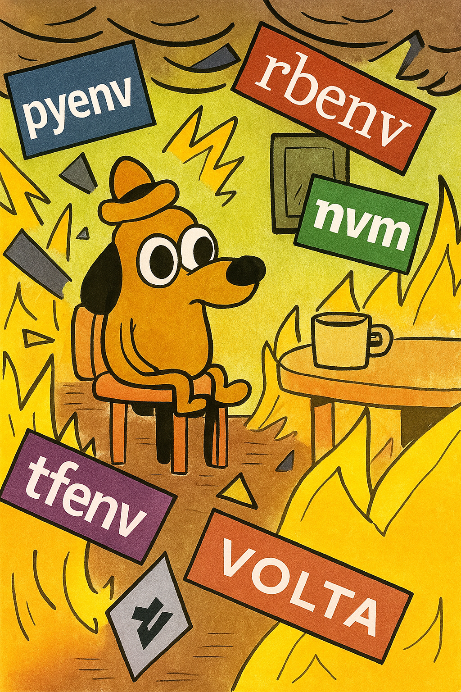
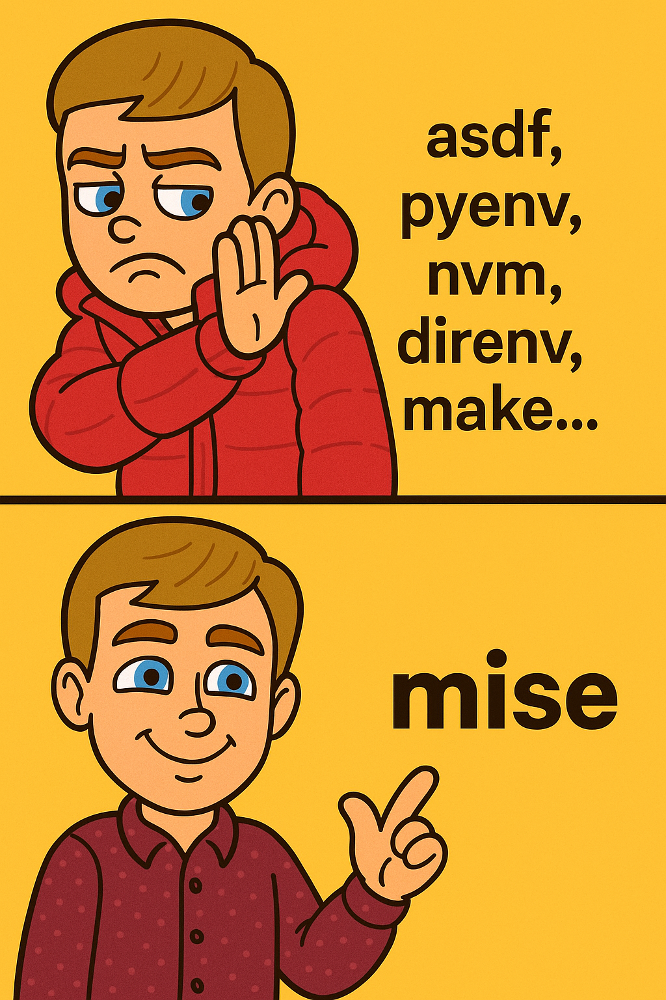

<!-- column_layout: [1, 1] -->

<!-- column: 0 -->



<!-- pause -->

<!-- column: 1 -->


<!-- end_slide -->

Meet `mise` ⚡
---

<!-- pause -->
<!-- incremental_lists: true -->

- 🦀 Open source, written in Rust, created by `@jdx`
- ⚒️ Universal version manager for languages and dev tools
- 🪄 Replaces individual tools like `tfenv`/`nvm`/`pyenv` etc.
- 🗄️ Declare tools versions in projects (`.python-version`)
- 📂 Switches versions in milliseconds when you `cd`
- ⬇️ Automatically downloads missing tools
- 🌍 Declare global tool versions (e.g. `mise use -g jq@latest`)
- ⚙️ Supports CI (e.g. GitHub Actions, GitLab CI)
- 🤝 Your team doesn't need to migrate but they might want to
- 🐚 Temporarily use a tool (e.g. `mise shell aws-cli@2.9.9`)

> https://github.com/jdx/mise

<!-- pause -->

# And moar 🌈
- `environments` (alternative to `direnv`)
- `tasks` (alternative to `make`)
- `secrets`
- `hooks` 
- Native Windows support (not just `wsl`)

<!-- end_slide -->

Which languages and tools are supported? ⚒️
---

| **Programming Languages** | **DevOps / IaC / Cloud** | **CLI Developer Tools** |
|---------------------------|---------------------------|--------------------------|
| `python`                  | `terraform`               | `jq`                    |
| `node`                    | `opentofu`                | `yq`                    |
| `go`                      | `pulumi`                  | `bat`                   |
| `java`                    | `aws-cli`                 | `ripgrep`               |
| `rust`                    | `gcloud`                  | `fd`                    |
| `ruby`                    | `azure`                   | `fzf`                   |
| `swift`                   | `kubectl`                 | `delta`                 |
| `php`                     | `helm`                    | `age`                   |
| `dotnet`                  | `docker-compose`          | `github-cli`            |
| `kotlin`                  | `tflint`                  | `lazygit`               |
| `scala`                   | `ansible`                 | `neovim`                |
| `dart`                    | `vault`                   | `starship`              |
| `elixir`                  | `consul`                  | `trivy`                 |
| `haskell`                 | `nomad`                   | `btop`                  |

> https://mise.jdx.dev/registry.html

<!-- end_slide -->

Declare versions in project files 📂
---

<!-- column_layout: [6, 4] -->

<!-- column: 0 -->

# Idiomatic version files

| Tool      | Version Files |
|-----------|---------------|
| Go        | `.go-version`, `go.mod` |
| Java      | `.java-version`, `.sdkmanrc` |
| Node      | `.nvmrc`, `.node-version` |
| Python    | `.python-version` |
| Ruby      | `.ruby-version`, `Gemfile` |
| Terraform | `.terraform-version`, `main.tf` |
| Crystal   | `.crystal-version` |
| Elixir    | `.exenv-version` |

<!-- column: 1 -->

# Centralised files

**mise**: `mise.toml`

**asdf**: `.tool-versions`

<!-- reset_layout -->

> https://mise.jdx.dev/configuration.html

<!-- end_slide -->

`mise.toml` ⚙️
---

```toml
[tools]
python = "3.11"
node = "22"
terraform = "1.9.8"
aws-cli = "latest"
"pipx:uv" = "latest"
"npm:@anthropic-ai/claude-code" = "latest"

[env]
# auto create and activate virtual environment
_.python.venv = { path = '.venv', create = true }
```

<!-- end_slide -->

Demo 🎭
---

<!-- column_layout: [1, 1] -->

<!-- column: 0 -->

```sh
# 1) one off tool usage
mise exec node@22 -- node -v
node -v

# 2) set global tools
mise use --global node@lts
node -v
which node
mise use -g terraform jq go bat
terraform -v
jq --version
go version
mise ls
```

<!-- column: 1 -->

```sh
# 3) activate when cd
cd myproj
mise use node@23 pnpm@10
node -v
pnpm -v
bat mise.toml
mise ls

# 4) deactivate when cd
cd ..
node -v
```

<!-- end_slide -->

Frequently asked questions 💡
---

<!-- pause -->

# How is this different from `asdf`?

Drop in replacement. Better performance¹, improved security, better DX, more (optional) features/packages, and doesn't require shims.

> _¹ Performance is still better but `asdf` had a recent rewrite in `go`_
> https://mise.jdx.dev/dev-tools/comparison-to-asdf.html

<!-- pause -->

# But what about `homebrew` or `apt` etc.?

You can carry on using `brew` to install things, expecially GUI apps with `casks`.
`mise` is useful for sharing tools on projects and keeping your environment clean/isolated.

<!-- pause -->

# Why not use `nix` or something else that's _"better"_?

Yeah go for it. But `nix` is more involved and is probably a harder sell to your team.

<!-- end_slide -->

FIN 👋
---

<!-- column_layout: [1, 1] -->

<!-- column: 0 -->



<!-- column: 1 -->

# How to get started?

```sh
brew install mise
# or
curl https://mise.run | sh
```

> https://github.com/jdx/mise
> https://mise.jdx.dev/

# Questions?

Ask today 🗣️ Or online 🌐 `@connorads`

