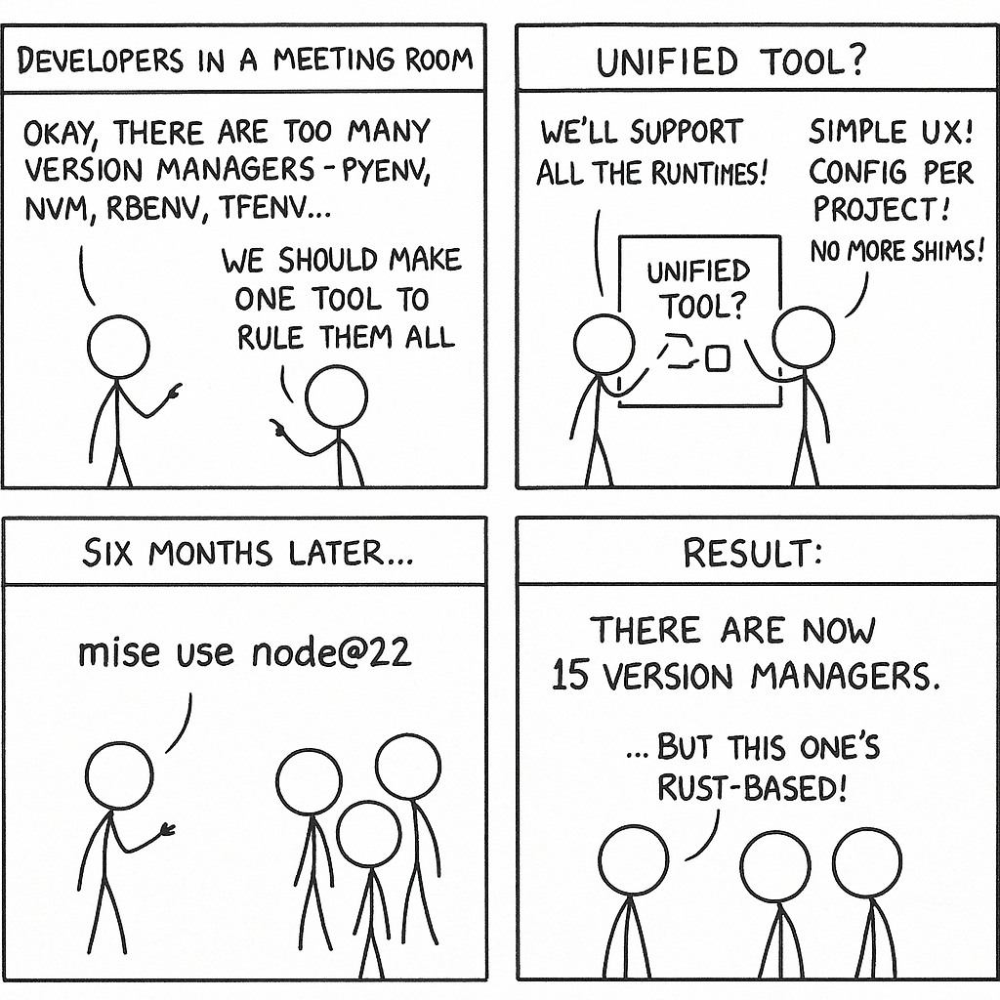

<!-- end_slide -->

Meet `mise` ⚡
---

<!-- pause -->

- 🦀 `mise` is a single binary (Rust)
- 🪄 One tool: drop‑in replacement for `asdf`/`nvm`/`pyenv` etc.
- 🗄️ Declare different versions of tools in projects (or globally)
- 📂 Installs & switches versions in milliseconds when you `cd`
- 🐚 Temporarily use a tool (e.g. `mise shell aws-cli@2.9.9`)
- 🤝 Your team doesn't need to migrate but they might want to
- ⚙️ Supports CI (e.g. GitHub Actions, GitLab CI)

> https://github.com/jdx/mise

<!-- pause -->

# And moar 🌈
- `environments` (alternative to `direnv`)
- `tasks` (alternative to `make`)
- `secrets` (alternative to `dotenv`)
- `hooks` 

<!-- end_slide -->

Which tools are supported? ⚒️
---

| **Programming Languages** | **DevOps / IaC / Cloud** | **CLI Developer Tools** |
|---------------------------|---------------------------|--------------------------|
| `python`                  | `terraform`               | `jq`                    |
| `node`                    | `opentofu`                | `yq`                    |
| `go`                      | `pulumi`                  | `bat`                   |
| `java`                    | `aws-cli`                 | `ripgrep`               |
| `rust`                    | `gcloud`                  | `fd`                    |
| `ruby`                    | `azure`                   | `fzf`                   |
| `swift`                   | `kubectl`                 | `delta`                 |
| `php`                     | `helm`                    | `age`                   |
| `dotnet`                  | `docker-compose`          | `github-cli`            |
| `kotlin`                  | `tflint`                  | `lazygit`               |
| `scala`                   | `ansible`                 | `neovim`                |
| `dart`                    | `vault`                   | `starship`              |
| `elixir`                  | `consul`                  | `trivy`                 |
| `haskell`                 | `nomad`                   | `btop`                  |

> https://mise.jdx.dev/registry.html

<!-- end_slide -->

Declare versions in project files 📂
---

<!-- column_layout: [6, 4] -->

<!-- column: 0 -->

# Reads *existing* idiomatic version files

| Tool      | Version Files |
|-----------|---------------|
| Go        | `.go-version`, `go.mod` |
| Java      | `.java-version`, `.sdkmanrc` |
| Node      | `.nvmrc`, `.node-version` |
| Python    | `.python-version` |
| Ruby      | `.ruby-version`, `Gemfile` |
| Terraform | `.terraform-version`, `main.tf` |
| Crystal   | `.crystal-version` |
| Elixir    | `.exenv-version` |

<!-- column: 1 -->

# Or use centralised files

**mise**: `mise.toml`

**asdf**: `.tool-versions`

<!-- reset_layout -->

> https://mise.jdx.dev/configuration.html

<!-- end_slide -->

`mise.toml` ⚙️
---

```toml
[tools]
python = 3.11
node = 22
terraform = "1.9.8"
aws-cli = "latest"
"pipx:uv" = "latest"
"npm:@anthropic-ai/claude-code" = "latest"

[env]
# auto create and activate virtual environment
_.python.venv = { path = '.venv', create = true }
```

<!-- end_slide -->

Demo 🎭
---

<!-- column_layout: [1, 1] -->

<!-- column: 0 -->

```sh
# Use tools for just one command
mise exec node@22 -- node -v
node -v

# Make tools available globally
mise use --global node@lts
node -v
which node
mise use -g terraform jq go bat
terraform -v
jq --version
go version
mise ls
```

<!-- column: 1 -->

```sh
# activate mise tools automatically
cd myproj
mise use node@23 pnpm@10
node -v
pnpm -v
bat mise.toml
mise ls

# deactivated when leaving folder
cd ..
node -v
```

<!-- end_slide -->

Frequently asked questions 💡
---

<!-- pause -->

# How is this different from `asdf`?

Drop in replacement. Better performance¹, improved security, better DX, and lack of reliance on shims.

_¹ Performance is still better but `asdf` had a recent rewrite in `go`_

> https://mise.jdx.dev/dev-tools/comparison-to-asdf.html

<!-- pause -->

# But what about `homebrew` or `apt` etc.?

You can carry on using `brew` to install things, expecially GUI apps with `casks`. But you might want to consider using `mise` for _"developer tools"_. Especially when you want to use specific tool versions with others.

<!-- pause -->

# Why not use `nix` or something else that's _"better"_?

Yeah go for it. But `nix` is a bit more involved and is probably a harder sell for your teamates.
